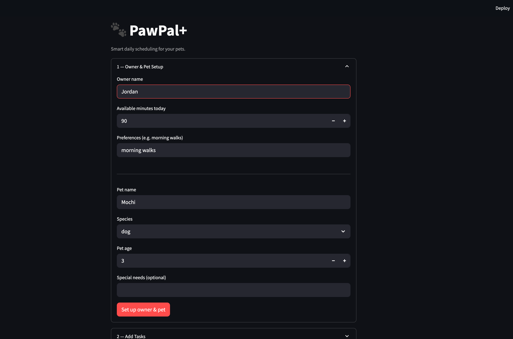
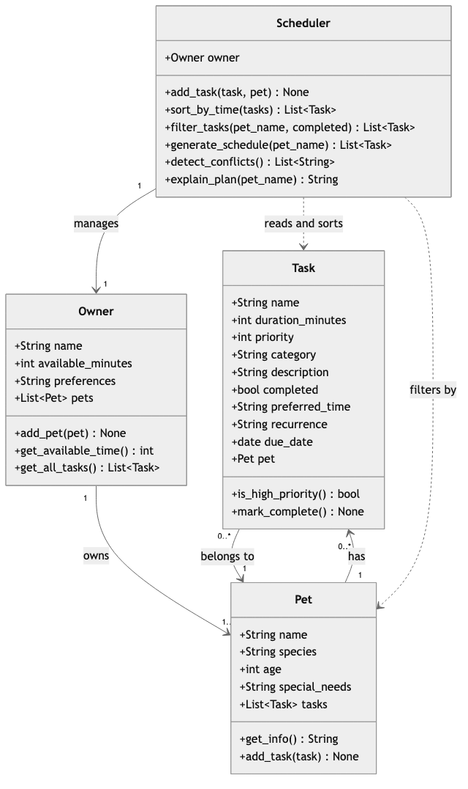

# PawPal+ (Module 2 Project)

**PawPal+** is a Streamlit app that helps a pet owner plan and schedule daily care tasks for their pet(s) using smart prioritization, time-aware sorting, conflict detection, and recurring task automation.

## 📸 Demo



<a href="/course_images/ai110/pawpal_screenshot.png" target="_blank"></a>

## Features

- **Priority-based scheduling** — Tasks are ranked 1–5. The `Scheduler` fills the owner's daily time budget with the highest-priority tasks first, then uses preferred time as a tiebreaker so nothing important gets dropped.

- **Time-aware sorting** — Every task can carry an optional `preferred_time` in `HH:MM` format. `Scheduler.sort_by_time()` uses a lambda key to return tasks in chronological order, with untimed tasks pushed to the end.

- **Conflict warnings** — `Scheduler.detect_conflicts()` compares every pair of timed, pending tasks per pet. If two tasks' time windows overlap, the UI surfaces a plain-language warning *before* the schedule is generated, so the owner can fix the conflict first.

- **Recurring tasks** — Tasks marked `"daily"` or `"weekly"` automatically spawn the next occurrence when marked complete. Python's `timedelta` calculates the exact next `due_date` — no manual re-entry needed.

- **Flexible filtering** — `Scheduler.filter_tasks(pet_name, completed)` lets the UI slice tasks by pet or status. Powers the "pending only" view and per-pet schedule breakdowns.

- **Multi-pet support** — `Owner` holds a list of `Pet` objects, each with their own task list. The `Scheduler` aggregates across all pets for the full daily plan.

## System Architecture



## Getting started

### Setup

```bash
python -m venv .venv
source .venv/bin/activate  # Windows: .venv\Scripts\activate
pip install -r requirements.txt
```

### Run the app

```bash
streamlit run app.py
```

### Run the test suite

```bash
python -m pytest tests/test_pawpal.py -v
```

## Testing PawPal+

18 tests across 5 categories:

| Category | Tests | Description |
|---|---|---|
| **Sorting** | 3 | Tasks return in chronological HH:MM order; untimed tasks go last; schedule respects priority descending |
| **Recurrence** | 4 | Daily tasks spawn next occurrence with `due_date + 1 day`; weekly tasks use `+ 7 days`; non-recurring tasks don't spawn; new task inherits all properties |
| **Conflict detection** | 4 | Overlapping windows flagged; same start time flagged; back-to-back tasks are not flagged; completed tasks are excluded from checks |
| **Edge cases** | 4 | Empty pet returns no schedule; owner with no pets returns no schedule; tasks that exceed the time budget are dropped; filter by pet name returns correct subset |
| **Core behaviors** | 3 | `mark_complete()` sets status; `add_task()` increments count; `filter_tasks(completed=True)` returns only done tasks |

### Confidence level

★★★★☆ (4/5)

The core scheduling logic — priority sorting, time budgeting, recurrence, and conflict detection — is fully tested and all 18 tests pass. One star withheld because the Streamlit UI layer (`app.py`) and multi-pet conflict scenarios (tasks across different pets) are not yet covered by automated tests.

## Smarter Scheduling — How it works

**Time-aware sorting** — `Scheduler.sort_by_time()` uses a lambda key to sort HH:MM strings. Untimed tasks default to `"99:99"` so they always sink to the end.

**Flexible filtering** — `Scheduler.filter_tasks(pet_name, completed)` lets you slice the task list by pet or completion status (or both).

**Recurring tasks** — `Task.mark_complete()` checks `self.recurrence` and calls `pet.add_task()` with a new `Task` whose `due_date` is `base + timedelta(days=1)` or `timedelta(weeks=1)`.

**Conflict detection** — `Scheduler.detect_conflicts()` converts `HH:MM` to minutes-since-midnight and tests every task pair with `start_a < end_b and start_b < end_a`.

## Scenario

A busy pet owner needs help staying consistent with pet care. They want an assistant that can:

- Track pet care tasks (walks, feeding, meds, enrichment, grooming, etc.)
- Consider constraints (time available, priority, owner preferences)
- Produce a daily plan and explain why it chose that plan
