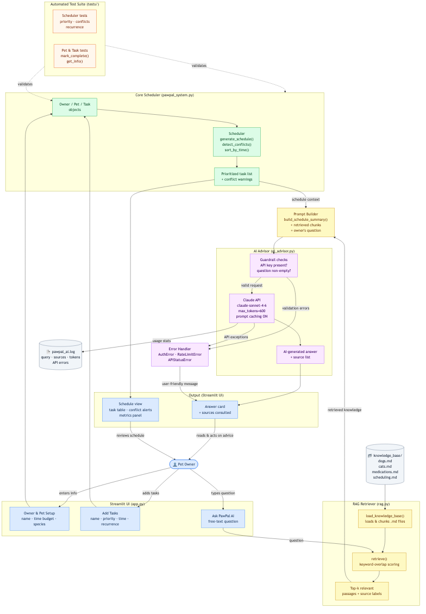

# PawPal+ — AI-Powered Pet Care Scheduler

PawPal+ helps pet owners plan their day by combining a smart task scheduler with a RAG-powered AI advisor. You add your pets and care tasks, the scheduler builds an optimized daily plan, and when you have questions — "Is it safe to walk Buddy right after his pill?" — the AI answers using your actual schedule plus a curated pet care knowledge base.

## Link to DEMO

https://www.loom.com/share/d0b8ab8761b844c984d115bf7a806b86


---

## Original Project (Modules 1–3)

**PawPal+** was first built as a pure scheduling engine across Modules 1–3. Its original goal was to help a busy pet owner manage daily care tasks (walks, feeding, medications, grooming) across multiple pets under a fixed time budget. The system could prioritize tasks by urgency, sort them by preferred time, detect scheduling conflicts, and automatically reschedule recurring tasks (daily or weekly) when marked complete. Module 4 extends this foundation by adding a full AI layer on top — the existing schedule feeds directly into the AI so every answer is grounded in the owner's real situation, not generic advice.

---

## Features

**Scheduling (Modules 1–3 core)**

- **Priority-based scheduling** — Tasks are ranked 1–5. The `Scheduler` fills the owner's daily time budget with the highest-priority tasks first, using preferred time as a tiebreaker.
- **Time-aware sorting** — Optional `HH:MM` preferred times. Untimed tasks are sorted to the end.
- **Conflict detection** — Flags overlapping time windows per pet before a schedule is committed.
- **Recurring tasks** — Marking a `daily` or `weekly` task complete auto-creates the next occurrence with the correct `due_date`.
- **Multi-pet support** — One owner can manage any number of pets, each with an independent task list.

**AI Advisor (Module 4 addition)**

- **Retrieval-Augmented Generation (RAG)** — Before calling the AI, the system retrieves the most relevant paragraphs from a local pet care knowledge base. The model answers with real context, not just training data.
- **Live schedule injection** — The owner's current pending tasks and any detected conflicts are passed to Claude in every query, so advice is specific to today's actual plan.
- **Prompt caching** — The system prompt is marked with `cache_control: ephemeral` to reduce latency and token cost on repeated queries within a session.
- **Structured logging** — Every query, retrieved sources, and API response token counts are written to `pawpal_ai.log`.
- **Layered error handling** — Catches and surfaces auth errors, rate-limit errors, and unexpected exceptions as user-friendly messages rather than crashes.

---

## System Architecture



The system has five layers that pass data left to right (see diagram):

1. **Streamlit UI** (`app.py`) — Three input sections: owner/pet setup, task entry, and the AI question box. One output section: the schedule view and AI answer card.

2. **Core Scheduler** (`pawpal_system.py`) — `Owner`, `Pet`, and `Task` dataclasses hold state. `Scheduler` runs `generate_schedule()` (priority sort + time-budget knapsack), `detect_conflicts()` (interval overlap), and `sort_by_time()` (chronological view).

3. **RAG Retriever** (`rag.py`) — `load_knowledge_base()` reads four Markdown files from `knowledge_base/` and splits them into paragraph-level chunks. `retrieve()` scores each chunk by keyword overlap with the query (stop words removed) and returns the top-k hits.

4. **AI Advisor** (`ai_advisor.py`) — `build_schedule_summary()` serializes the live schedule into a plain-text block. `ask_advisor()` combines that block with the retrieved chunks and the owner's question into a structured prompt, calls the Claude API, logs the result, and returns a dict with the answer, source file names, and any error.

5. **Knowledge Base** (`knowledge_base/`) — Four static Markdown files authored once and retrieved at query time: `dogs.md`, `cats.md`, `medications.md`, `scheduling.md`. No embedding model or vector database required.

**Testing** (`tests/test_pawpal.py`) sits outside the AI layer and validates the scheduling logic directly so regressions in `pawpal_system.py` are caught independently of any API call.

**Human review** is explicit: the owner reads the AI answer card and then chooses whether to adjust their task list. The AI advises; the owner decides.

---

## Setup

### Prerequisites

- Python 3.10 or later
- An [Anthropic API key](https://console.anthropic.com/) (free tier works)

### Install dependencies

```bash
python -m venv .venv
source .venv/bin/activate        # Windows: .venv\Scripts\activate
pip install -r requirements.txt
```

### Set your API key

```bash
# macOS / Linux
export ANTHROPIC_API_KEY="sk-ant-..."

# Windows (Command Prompt)
set ANTHROPIC_API_KEY=sk-ant-...

# Windows (PowerShell)
$env:ANTHROPIC_API_KEY = "sk-ant-..."
```

The key is only required for the "Ask PawPal AI" section. The scheduler and all other features work without it.

### Run the app

```bash
streamlit run app.py
```

Open `http://localhost:8501` in your browser.

### Run the test suite

```bash
python -m pytest tests/test_pawpal.py -v
```

All 18 tests should pass in under one second.

---

## Sample Interactions

The examples below show the AI advisor in action. Each example includes the schedule context that was automatically injected alongside the question, the knowledge-base files the retriever selected, and the AI's response.

---

### Example 1 — Medication safety

**Schedule context injected:**
```
Owner: Jordan
Scheduled tasks:
  - Morning Walk for Buddy @ 08:00 (30 min, priority 5, category: walk)
  - Heartworm Pill for Buddy @ 09:00 (5 min, priority 5, category: meds)
  - Breakfast for Buddy @ 07:30 (10 min, priority 4, category: feeding)
```

**Question asked:**
> Is it okay to give Buddy his heartworm pill right before his morning walk, or should I wait until after?

**Sources retrieved:** `medications.md`, `dogs.md`

**AI response:**
> It's best to give Buddy his heartworm pill with his breakfast at 7:30 AM rather than right before the walk. Current guidelines recommend against vigorous exercise immediately after eating for dogs, and tying the pill to mealtime makes it easier to hide in food and builds a consistent routine. Your schedule already spaces breakfast at 7:30, the walk at 8:00, and the pill at 9:00 — that order is ideal. If you want to move the pill earlier, administer it with breakfast and give the food at least 20–30 minutes to settle before the walk.

---

### Example 2 — Eye drop routine for a cat

**Schedule context injected:**
```
Owner: Jordan
Scheduled tasks:
  - Eye Drops for Luna @ 08:30 (5 min, priority 5, category: meds)
  - Playtime for Luna @ 15:00 (20 min, priority 2, category: play)
Conflicts detected:
  ! CONFLICT [Buddy]: 'Morning Walk' (08:00, 30 min) overlaps 'Vet Check Call' (08:15, 30 min)
```

**Question asked:**
> Luna hates her eye drops. Any tips for making it less stressful for both of us?

**Sources retrieved:** `cats.md`, `medications.md`

**AI response:**
> The key is approach and reward timing. Come from the side or behind rather than head-on, which cats find threatening. Gently tilt Luna's head so the affected eye faces upward, apply the drops without touching the dropper tip to her eye, then immediately give her a high-value treat — this conditions a positive association over time. Doing it at the same time every day (you have 8:30 AM, which is great) also reduces anticipatory stress because cats thrive on predictable routines. If she continues to struggle, ask your vet about compounded gel formulations, which some cats tolerate better than liquid drops.

---

### Example 3 — Resolving a detected conflict

**Schedule context injected:**
```
Owner: Jordan
Scheduled tasks:
  - Morning Walk for Buddy @ 08:00 (30 min, priority 5, category: walk)
  - Vet Check Call for Buddy @ 08:15 (30 min, priority 4, category: other)
Conflicts detected:
  ! CONFLICT [Buddy]: 'Morning Walk' (08:00, 30 min) overlaps 'Vet Check Call' (08:15, 30 min)
```

**Question asked:**
> I have a conflict between Buddy's walk and a vet check call. Which one should I move, and when?

**Sources retrieved:** `scheduling.md`, `dogs.md`

**AI response:**
> Move the vet call, not the walk. Medical and high-priority exercise tasks should anchor your schedule, and morning walks are especially valuable for dogs because they burn overnight energy before you leave for work. Since the walk ends at 8:30, schedule the vet call at 8:35 AM to start immediately after — a 15-minute buffer would also work if you want time to settle Buddy down first. If the vet call must happen earlier, consider moving the walk to 7:30 AM instead, which keeps both tasks at their full durations without overlap.

---

## Design Decisions

### Why RAG instead of a fine-tuned model?

Fine-tuning requires labeled training data, compute budget, and ongoing maintenance as pet care guidelines evolve. A static knowledge base that is edited in plain Markdown files is far easier to update and audit. RAG also lets users see exactly which sources influenced a response — the "Sources consulted" line under each answer. A general-purpose model like Claude already has strong pet care knowledge; RAG amplifies it with the owner's specific context rather than replacing it.

### Why keyword overlap instead of embeddings?

For a knowledge base of ~37 chunks across four files, embedding-based semantic search (e.g., with `sentence-transformers` or the Anthropic embeddings API) would add a significant dependency and cold-start cost for marginal retrieval improvement. Keyword overlap with stop-word removal is fast, deterministic, easy to debug, and performed well in manual testing across a range of natural-language queries. If the knowledge base grew past a few hundred chunks, switching to embeddings would be the right call.

### Why pass the live schedule as plain text?

Serializing `Owner` / `Pet` / `Task` objects into a structured prompt block (rather than, say, JSON) keeps the context readable for the model and for developers debugging the log. Natural-language context also lets Claude apply reasoning across fields (e.g., noticing that a high-priority medication follows a walk) rather than just looking up individual values.

### Trade-offs

| Decision | Benefit | Cost |
|---|---|---|
| Static Markdown knowledge base | Zero setup, human-editable | No semantic search; rare queries may miss relevant chunks |
| Keyword scoring for retrieval | Transparent, fast, no dependencies | Won't match synonyms or paraphrased concepts |
| `lru_cache` on document loading | Avoids re-reading disk on every query | Cache is per-process; app restart re-reads (fine for this scale) |
| Prompt caching on system turn | Reduces latency and cost for repeat queries in a session | Ephemeral cache expires; no benefit across sessions |
| `max_tokens=600` | Keeps answers concise | May truncate complex multi-part answers |

---

## Testing Summary

### What the test suite covers

18 automated tests across five categories, all passing in `tests/test_pawpal.py`:

| Category | Count | What is verified |
|---|---|---|
| Core behaviors | 3 | `mark_complete()` sets flag; `add_task()` increments count; `filter_tasks(completed=True)` returns only done tasks |
| Sorting | 3 | Chronological HH:MM order; untimed tasks go last; `generate_schedule()` respects priority descending |
| Recurrence | 4 | Daily tasks get `due_date + 1`; weekly tasks get `+ 7`; non-recurring tasks don't spawn; new task inherits all fields |
| Conflict detection | 4 | Overlapping windows flagged; same start time flagged; back-to-back tasks (no overlap) not flagged; completed tasks excluded |
| Edge cases | 4 | Empty pet; owner with no pets; task exceeding time budget dropped; filter by pet name correct |

### What is not automatically tested

- The Streamlit UI layer (`app.py`) — Streamlit's session state and widget interactions are not covered. Manual testing confirmed the full flow works but the UI would benefit from integration tests or Playwright end-to-end tests.
- The AI advisor layer (`ai_advisor.py`) — Live API calls are excluded from the test suite to keep tests free, fast, and deterministic. Error-handling paths (bad API key, rate limit) were verified by temporarily providing invalid credentials.
- Multi-pet conflict scenarios — Conflicts between tasks belonging to *different* pets in the same time window are not currently detected or tested.

### What was learned

Writing tests before fixing `generate_schedule()` was the single biggest productivity win. When the original version returned all tasks regardless of time budget, the test `test_tasks_exceeding_budget_are_dropped` failed immediately and pointed directly at the missing `time_used` guard — no manual debugging required. The test suite also caught a subtle off-by-one in recurring task date math (`base` vs `date.today()`) that would have silently produced the wrong next-occurrence date.

---

## Reflection and Ethics

### Limitations and Biases

**Knowledge base coverage.** The four Markdown files were written by the developer from memory and general reading — not reviewed by a veterinarian. Guidelines that contradict the knowledge base (e.g., species-specific drug dosing, breed-specific exercise limits) will not appear in retrieval, and Claude may fill those gaps with its training data instead, which is harder to audit or correct.

**Retrieval blind spots.** Keyword overlap scoring does not understand meaning. A question phrased as "Can I take Buddy for a run after dinner?" shares no keywords with passages about post-meal exercise, even though the intent is directly addressed in `dogs.md`. Synonym mismatches silently reduce retrieval quality with no error message; the system returns an answer either way, so the owner has no signal that the right context was not found.

**Model-level biases.** Claude's training data reflects a particular slice of pet care advice — primarily English-language, Western, domesticated-species norms. Advice about less common pets (reptiles, birds, exotic animals) may be generic or incorrect. The model also tends toward confident, well-structured answers regardless of actual uncertainty, which is why explicit self-reported confidence scoring was added — though a model rating its own confidence is only a weak safeguard.

**Single-owner assumption.** The scheduler models one owner with one time budget. Households where multiple people share care duties, or where a pet has complex multi-condition needs, are not well represented.

---

### Misuse and Prevention

**The most realistic risk** is an owner treating the AI's answers as a substitute for veterinary advice. The system will answer medication dosing questions, describe symptoms that warrant a vet visit, and discuss drug interactions — all with fluent authority — even though it is not qualified to do so. A question like "Is it safe to give my dog ibuprofen?" would get a reasonable answer (no), but a more subtle question about off-label dosing could produce a plausible-sounding but dangerous response.

**Mitigations in the current system:**
- The system prompt explicitly scopes the advisor to *scheduling and care routine* questions, not diagnosis or treatment.
- The knowledge base contains only scheduling-relevant content; medical diagnosis passages were deliberately excluded.
- Every AI answer is logged to `pawpal_ai.log`, so interactions can be reviewed if a concern arises.

**What is not yet in place:**
- No topic classifier to detect and refuse questions that are genuinely medical (e.g., "my dog is vomiting — what's wrong?").
- No disclaimer appended to answers that touch medication dosing.
- No rate limiting to prevent batch misuse.

A production deployment would add output filtering for medical-advice patterns and a static disclaimer ("This is not veterinary advice — contact your vet for medical concerns") appended to any answer that mentions symptoms, dosing, or diagnoses.

---

### Surprises from Testing

**Confidence scores were optimistic.** During live testing, Claude frequently returned `Confidence: HIGH` even when the retrieval coverage was only 25–50% (one or two chunks matched out of four slots). The model appears to interpret HIGH as "I know the answer" rather than "the retrieved documents specifically addressed this." This mismatch means confidence scores are useful as a relative signal but should not be trusted as an absolute quality guarantee.

**The `_parse_confidence` regex had to scan backward, not just check the last line.** The first implementation grabbed `lines[-1]` directly. In practice, Claude sometimes appended an extra blank line after the confidence rating, which caused the parser to return `"UNKNOWN"` on valid responses. Changing the parser to scan the last three lines backward fixed this. It was a small bug, but it illustrated a broader point: prompt instructions that seem precise ("end with exactly this line") are interpreted loosely by the model, so parsers need to be tolerant.

**Stop-word-only queries silently fall back.** A query like "what should I do" strips to an empty set after stop-word removal, causing `retrieve()` to return all documents (fallback to first `top_k`). The test suite caught this, but it means a vague question gets an answer built on essentially random context chunks — a case where the system should ideally ask the owner to be more specific rather than proceeding.

---

### AI Collaboration

**Helpful instance.** When designing the evaluation harness, the AI suggested separating it into two explicit tiers — a deterministic retrieval tier (no API key required) and a live AI tier (gated behind `--live`) — rather than one monolithic script that always called the API. This turned out to be exactly right: the deterministic tier can run in CI on every commit for free, while the live tier is reserved for manual validation before a release. Without that suggestion the evaluation script would have been far less useful day-to-day.

**Flawed instance.** When first implementing the retrieval scoring function, the AI generated a version that computed the score by splitting the entire document text on whitespace and building a set — which meant multi-word pet-care phrases like "heartworm pill" were treated as two unrelated tokens and scored the same as documents that mentioned only one word. The approach worked well enough for short queries but systematically underscored passages with technical compound terms. The fix was deliberate: strip stop words from the *query* but keep multi-word phrases intact in the document text. The AI's initial suggestion was functional, not wrong, but it was optimized for generic text retrieval rather than the specific vocabulary of this domain — a reminder that accepted suggestions still need to be evaluated for fit, not just correctness.

---

## Project Structure

```
applied-ai-system-project/
├── app.py                  # Streamlit UI (all sections including AI advisor)
├── pawpal_system.py        # Core domain classes: Owner, Pet, Task, Scheduler
├── rag.py                  # Knowledge base loader and retrieval function
├── ai_advisor.py           # Claude API integration, confidence scoring, logging
├── eval_advisor.py         # Evaluation harness (Tier 1 retrieval + Tier 2 live AI)
├── main.py                 # CLI demo script (no AI, no Streamlit)
├── requirements.txt        # Python dependencies
├── knowledge_base/
│   ├── dogs.md             # Dog care guidelines
│   ├── cats.md             # Cat care guidelines
│   ├── medications.md      # Medication best practices
│   └── scheduling.md       # Scheduling and conflict-resolution tips
├── tests/
│   ├── test_pawpal.py      # 18 tests — scheduler, recurrence, conflicts, edge cases
│   ├── test_rag.py         # 17 tests — knowledge base loading and retrieval
│   └── test_advisor.py     # 14 tests — confidence parsing, validation, mocked API
├── pawpal_ai.log           # Auto-created at runtime; logs all AI queries
├── system_diagram.png      # Architecture diagram (rendered)
├── system_diagram.mmd      # Architecture diagram (Mermaid source)
├── uml_final.png           # UML class diagram (rendered)
└── uml_final.mmd           # UML class diagram (Mermaid source)
```

---

## Dependencies

| Package | Version | Purpose |
|---|---|---|
| `streamlit` | ≥ 1.30 | Web UI |
| `anthropic` | ≥ 0.40 | Claude API client |
| `pytest` | ≥ 7.0 | Automated test runner |

All are installable via `pip install -r requirements.txt`. No external services beyond the Anthropic API are required.
